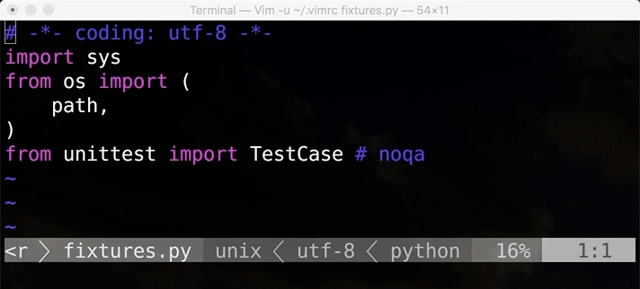

# vim-noqalign

Simple Vim wrapper for [noqalign](https://github.com/AriyaISIHARA/noqalign).



## Usage

### Invoke manually

Open Python file and just execute `:Noqalign`.

That's it.

### Automatically format on save

```viml
autocmd BufWritePost *.py, call noqalign#run(1)
```

## License

New BSD License
